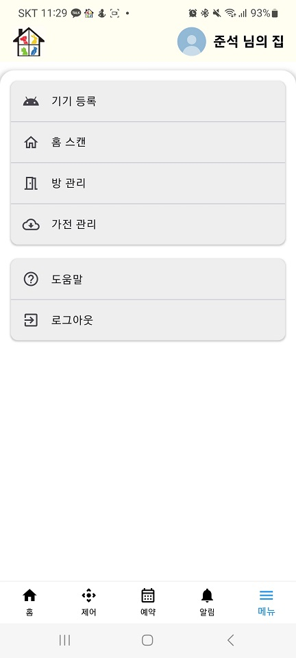
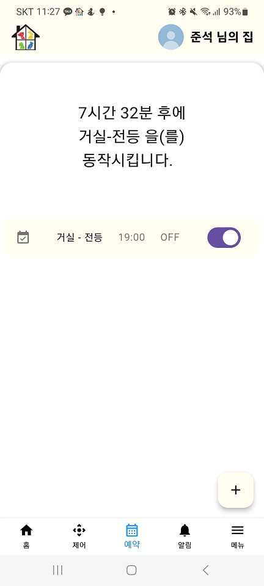
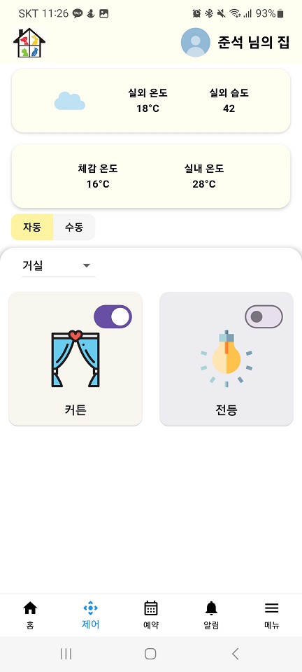
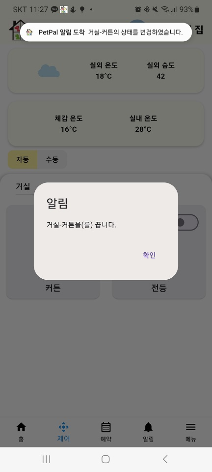
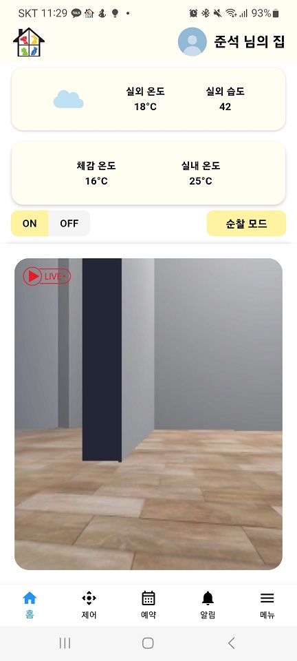
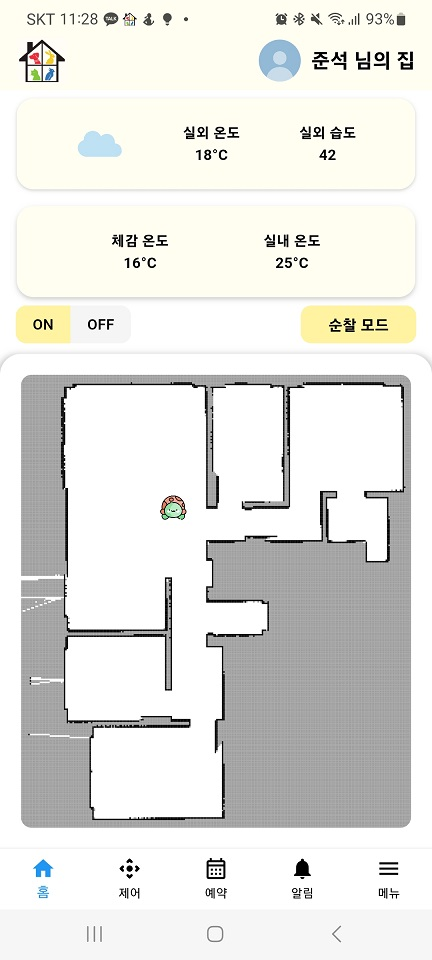
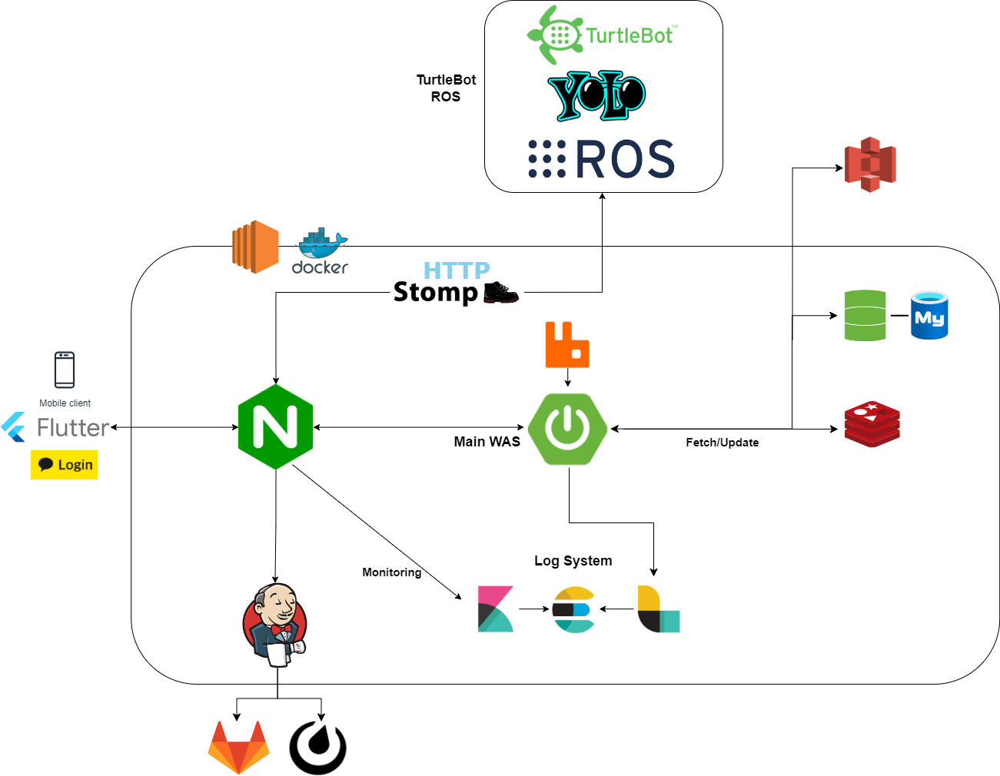
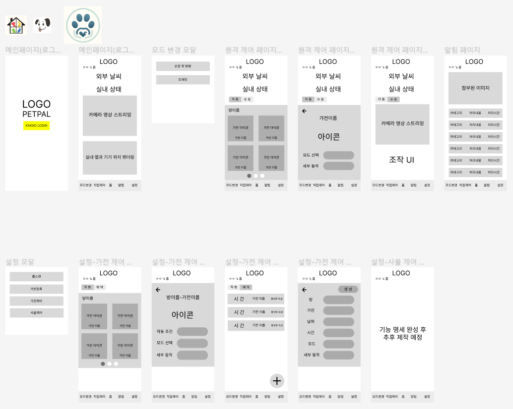
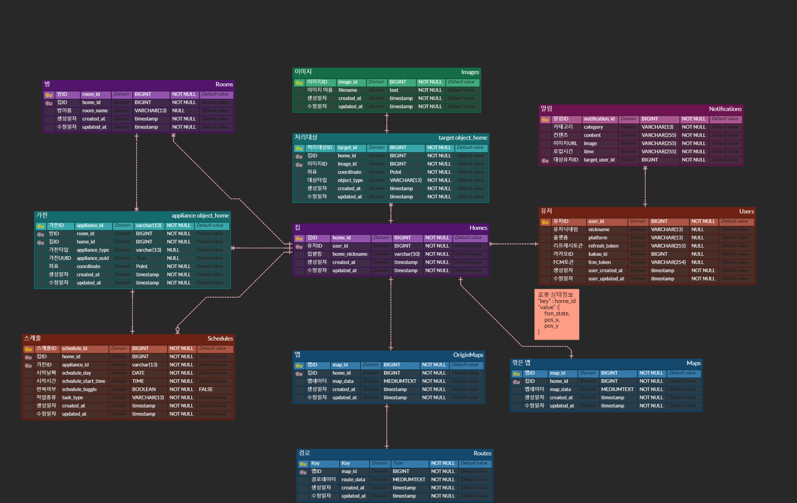
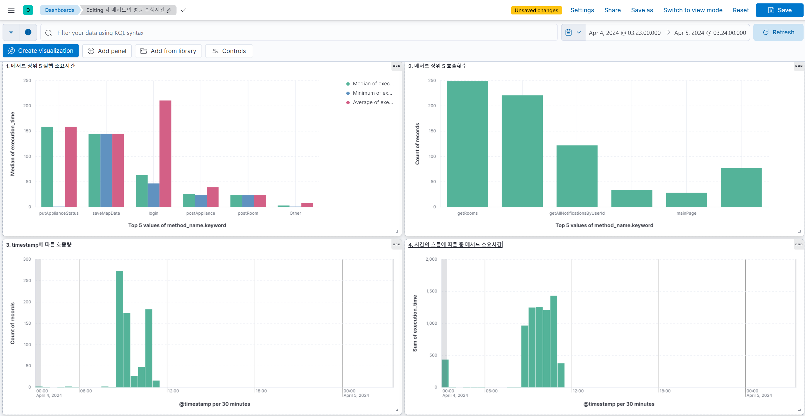

# PetPal

# 프로젝트 소개

### 550만 반려가구를 위한 외출 시 집에 혼자 남아있는 반려견을 돌봐주는 스마트 홈 모빌리티 서비스

## 프로젝트 기간

2024.03.19 ~ 2024.04.05

## 팀원

<table>
    <tr height="140px">
        <td align="center" width="150px">
            <a href="https://github.com/CactusKK"></a>
            <br />
            <a href="https://github.com/CactusKK">👑김태범</a>
        </td>
        <td align="center" width="150px">
            <a href="https://github.com/"></a>
            <br />
            <a href="https://github.com/">김승배</a>
        </td>
        <td align="center" width="150px">
            <a href="https://github.com/youngjoo0108"></a>
            <br />
            <a href="https://github.com/youngjoo0108">송영주</a>
        </td>
        <td align="center" width="150px">
            <a href="https://github.com/jsong98"></a>
            <br />
            <a href="https://github.com/jsong98">송준석</a>
        </td>
        <td align="center" width="130px">
            <a href="https://github.com/qhdrnak"></a>
            <br />
            <a href="https://github.com/qhdrnak">김봉균</a>
        </td>
        <td align="center" width="150px">
            <a href="https://github.com/madirony"></a>
            <br />
            <a href="https://github.com/madirony">연정흠</a>
        </td>
      <tr height="50px">
        <td align="center">
          <p>[Embedded]</p>
        </td>
        <td align="center">
          <p>[Embedded]</p>
        </td>
        <td align="center">
          <p>[Embedded]</p>
        </td>
        <td align="center">
          <p>[FE]</p>
        </td>
        <td align="center">
          <p>[BE] [Infra]</p>
        </td>
        <td align="center">
          <p>[BE] [Infra]</p>
        </td>
    </tr>
    </tr>
</table>

## 링크

https://j10a209.p.ssafy.io/
<br /><br />
[](https://cactus-page.notion.site/SSAFY-2-9-766f3d53fc394a309d2dd3c50249a764?pvs=4)

[](https://www.erdcloud.com/d/wfodjaKNd6gELR8Je)

[](https://www.figma.com/file/JSpNGQqZbQ8hGuu4tF1PZS/Prototype_v1?type=design&node-id=0%3A1&mode=design&t=sZsjT0TeMlnVtyAc-1)

<br />


# 개발 환경 / 기술 스택

### COMMON


### FRONT


### BACK


### IOT


### DEV TOOL & etc


# 기능 및 시연
## 기능

```
1. A* 알고리즘을 사용하여 경로 탐색 실행 및 자율 주행
2.가전 연동 후에는 버튼 클릭 한번으로 완전 자동화
3. Stomp & RabbitMQ 중심 Socket 통신
4. ROS에서 넘어오는 이미지 바이너리 데이터에 대해 Client에서 버퍼 구현 및 렌더링 레이턴시 관리로 영상구현
5. YOLOv8 알고리즘으로 시스템 전용 객체 감지 모델 학습
6. 객체 감지 모델을 통해 감지된 객체의 클래스에 따른 인터럽트 생성
7. 스케줄링을 통한 IoT 기기 제어로 실내 환경 셋팅
```
## 특장점
```
1. 반려견을 위한 환경 조성 시스템 : 시간과 날씨에 따라 IoT기기를 제어하여, 반려견이 편안함을 느끼는 실내 환경 조성
2. 카메라로 반려견을 인식하고 트래킹하여 반려견이 어디에 있든 스트리밍을 통해 견주가 반려견의 모습을 앱으로 확인 가능
3. 반려견 트래킹을 하며 주변에 위험 물체를 인식하고 처리를 하여 안전 사고 예방
4. 사용자가 거주 공간의 지도 이미지를 통해 한눈에 로봇의 위치와 반려견의 마지막 발견 위치 확인 가능
5. 자동으로 동작하는 로봇의 활동 내역을 앱의 알림을 통해 확인 가능
```

### Home Scan
a. [APP] - 하단 바에서 ‘메뉴’ - ‘홈 스캔’ 실행
<br />


### IoT 기기 등록
a. 모빌리티 로봇을 등록할 IoT 기기 근처에 배치
<br />
b. [APP] - 하단 바에서 ‘메뉴’ - ‘가전 관리’ - 우측 하단 ‘+’ 버튼 클릭
<br />
c. 모빌리티 기기와 IoT 기기 통신 대기
<br />
d. IoT 기기 등록 완료<br />

### IoT 기기 스케줄링
a. [APP] - 하단 바에서 ‘예약’ - 우측 하단 ‘+’ 버튼 클릭<br />
b. 방, 날짜, 시간 선택<br />
c. ‘저장’<br />


### IoT 기기 실시간 제어
a. [APP] - 하단 바에서 ‘제어’<br />
b. 좌측 상단 ‘방’ 선택<br />
c. 등록된 가전 아이콘 클릭<br />



### 모드 전환
a. [APP] - 하단 바에서 ‘홈’ - 우측 상단 ‘순찰/트래킹 모드’ 버튼 클릭<br />
b. 모드 전환 성공 메세지 확인<br />

### 터틀봇 완전 자율주행
#### 드리프트

#### 충돌방지1

#### 충돌방지2


### 스트리밍 및 맵 확인
a. [APP] - 하단 바에서 ‘홈’ - 좌측 상단 ‘ON’ 버튼 클릭<br />
b. 연결된 모빌리티 기기의 카메라 영상과 스캔된 지도 확인<br />



### 스트리밍


### 알림 확인
a. [APP] - 하단 바에서 ‘알림’<br />
b. 받은 알림 목록 확인<br />
c. 알림 메세지 클릭 - 알림 메세지 관련 이미지 확인<br />


# 시스템 아키텍처


# 와이어프레임


# ERD


# App Download Page


# 로깅 시스템

 **1번과 2번 대시보드**

- 어느 서비스 메서드가 자주, 그리고 오래 수행되는지 확인할 수 있습니다.
- 추후 사용량이 늘어났을 때, **메서드 별 부하를 추적하여 성능 최적화** 대상을 선정할 수 있습니다.
- 추가로 자주 사용되는 기능 혹은 페이지를 추적할 수 있기 때문에, 추후 광고를 붙인다고 한다면 **광고를 Display할 위치**를 정하는 데에 도움이 될 것으로 보입니다.

**3번과 4번 대시보드**

- 어느 시간대에 트래픽이 늘어나는지 효과적으로 추적할 수 있습니다.
- 그렇게 함으로써 향후 **유연한 스케일링**을 꾀할 수 있습니다.

# 디렉토리 구조
## Front
```
frontend
├── main.dart
│
├── component // Smaller units than screens, rendering detailed UIs within screens.
│ ├── control
│ │ ├── auto_control_screen.dart
│ │ └── manual_screen.dart
│ │
│ ├── reserve
│ │ └── create_reserve_screen.dart
│ │
│ ├── stream
│ │ ├── camera_screen.dart
│ │ ├── map_screen.dart
│ │ └── map_view_screen.dart
│ │
│ └── weather
│ ├── indoor_screen.dart
│ ├── outdoor_screen.dart
│ ├── weather_screen.dart
│ └── weather_text.dart
│
├── const // Defines global variables and methods used across the APK.
│ ├── colors.dart
│ ├── global_alert_dialog.dart
│ ├── map_painter.dart
│ ├── secure_storage.dart
│ ├── tabs.dart
│ └── time_creator.dart
│
├── model // Defines objects used for API integration and within the app itself.
│ ├── appliance.dart
│ ├── notification.dart
│ ├── reservation.dart
│ └── room.dart
│
├── screen // Defines the main screens of the APK and screens for each feature.
│ ├── control_screen.dart
│ ├── home_screen.dart
│ ├── login_screen.dart
│ ├── main_screen.dart
│ ├── menu_screen.dart
│ ├── mode_screen.dart
│ ├── noti_screen.dart
│ └── reserve_screen.dart
│
├── service // Functions needed for server and external API integration.
│ ├── control_service.dart
│ ├── fetch_weather.dart
│ ├── noti_service.dart
│ ├── reserve_service.dart
│ └── user_service.dart
│
└── socket // Defines functions related to WebSocket.
└── socket.dart
```
## Back
```
 └─petpal
    ├─.gradle
    │  ├─8.5
    │  │  ├─checksums
    │  │  ├─dependencies-accessors
    │  │  ├─executionHistory
    │  │  ├─fileChanges
    │  │  ├─fileHashes
    │  │  └─vcsMetadata
    │  ├─buildOutputCleanup
    │  └─vcs-1
    ├─.idea
    │  ├─dataSources
    │  │  ├─8fc5118a-3ac1-4a01-9d98-7e8151943105
    │  │  │  └─storage_v2
    │  │  │      └─_src_
    │  │  │          └─schema
    │  │  └─cb5d76ec-0422-43f7-9d7c-21bc44c40905
    │  │      └─storage_v2
    │  │          └─_src_
    │  │              └─schema
    │  ├─modules
    │  └─shelf
    │      ├─Uncommitted_changes_before_Update_at_2024-03-28_오후_12_50_[Changes]
    │      ├─Uncommitted_changes_before_Update_at_2024-03-28_오후_5_56_[Changes]
    │      ├─Uncommitted_changes_before_Update_at_2024-03-29_오후_12_22_[Changes]
    │      ├─Uncommitted_changes_before_Update_at_2024-03-31_오후_4_58_[Changes]
    │      ├─Uncommitted_changes_before_Update_at_2024-04-01_오전_10_04_[Changes]
    │      ├─Uncommitted_changes_before_Update_at_2024-04-01_오전_11_14_[Changes]
    │      ├─Uncommitted_changes_before_Update_at_2024-04-01_오전_11_37_[Changes]
    │      ├─Uncommitted_changes_before_Update_at_2024-04-01_오전_9_34_[Changes]
    │      ├─Uncommitted_changes_before_Update_at_2024-04-01_오후_2_10_[Changes]
    │      ├─Uncommitted_changes_before_Update_at_2024-04-01_오후_2_35_[Changes]
    │      ├─Uncommitted_changes_before_Update_at_2024-04-01_오후_4_07_[Changes]
    │      ├─Uncommitted_changes_before_Update_at_2024-04-02_오전_10_57_[Changes]
    │      ├─Uncommitted_changes_before_Update_at_2024-04-02_오후_3_54_[Changes]
    │      ├─Uncommitted_changes_before_Update_at_2024-04-02_오후_6_10_[Changes]
    │      ├─Uncommitted_changes_before_Update_at_2024-04-02_오후_6_52_[Changes]
    │      ├─Uncommitted_changes_before_Update_at_2024-04-03_오후_12_23_[Changes]
    │      ├─Uncommitted_changes_before_Update_at_2024-04-04_오전_10_15_[Changes]
    │      └─Uncommitted_changes_before_Update_at_2024-04-04_오전_9_57_[Changes]
    ├─build
    │  ├─classes
    │  │  └─java
    │  │      ├─main
    │  │      │  └─com
    │  │      │      └─ssafy
    │  │      │          └─petpal
    │  │      │              ├─aop
    │  │      │              ├─auth
    │  │      │              │  ├─controller
    │  │      │              │  ├─dto
    │  │      │              │  ├─enums
    │  │      │              │  ├─filter
    │  │      │              │  ├─models
    │  │      │              │  ├─service
    │  │      │              │  └─utils
    │  │      │              ├─common
    │  │      │              ├─config
    │  │      │              ├─control
    │  │      │              │  ├─controller
    │  │      │              │  └─dto
    │  │      │              ├─exception
    │  │      │              ├─home
    │  │      │              │  ├─controller
    │  │      │              │  ├─dto
    │  │      │              │  ├─entity
    │  │      │              │  ├─repository
    │  │      │              │  └─service
    │  │      │              ├─image
    │  │      │              │  ├─controller
    │  │      │              │  ├─dto
    │  │      │              │  ├─entity
    │  │      │              │  ├─repository
    │  │      │              │  └─service
    │  │      │              ├─map
    │  │      │              │  ├─controller
    │  │      │              │  ├─dto
    │  │      │              │  ├─entity
    │  │      │              │  ├─repository
    │  │      │              │  └─service
    │  │      │              ├─notification
    │  │      │              │  ├─controller
    │  │      │              │  ├─dto
    │  │      │              │  ├─entity
    │  │      │              │  ├─repository
    │  │      │              │  └─service
    │  │      │              ├─object
    │  │      │              │  ├─controller
    │  │      │              │  ├─dto
    │  │      │              │  ├─entity
    │  │      │              │  ├─repository
    │  │      │              │  └─service
    │  │      │              ├─room
    │  │      │              │  ├─controller
    │  │      │              │  ├─dto
    │  │      │              │  ├─entity
    │  │      │              │  ├─repository
    │  │      │              │  └─service
    │  │      │              ├─route
    │  │      │              │  ├─controller
    │  │      │              │  ├─dto
    │  │      │              │  ├─entity
    │  │      │              │  ├─repository
    │  │      │              │  └─service
    │  │      │              ├─schedule
    │  │      │              │  ├─controller
    │  │      │              │  ├─dto
    │  │      │              │  ├─entity
    │  │      │              │  ├─repository
    │  │      │              │  └─service
    │  │      │              ├─user
    │  │      │              │  ├─controller
    │  │      │              │  ├─dto
    │  │      │              │  ├─entity
    │  │      │              │  ├─repository
    │  │      │              │  └─service
    │  │      │              └─web
    │  │      │                  └─controller
    │  │      └─test
    │  │          └─com
    │  │              └─ssafy
    │  │                  └─petpal
    │  │                      └─control
    │  ├─generated
    │  │  └─sources
    │  │      ├─annotationProcessor
    │  │      │  └─java
    │  │      │      ├─main
    │  │      │      └─test
    │  │      └─headers
    │  │          └─java
    │  │              ├─main
    │  │              └─test
    │  ├─reports
    │  │  └─tests
    │  │      └─test
    │  │          ├─classes
    │  │          ├─css
    │  │          ├─js
    │  │          └─packages
    │  ├─resources
    │  │  └─main
    │  │      ├─static
    │  │      │  ├─assets
    │  │      │  ├─css
    │  │      │  └─js
    │  │      └─templates
    │  ├─test-results
    │  │  └─test
    │  │      └─binary
    │  └─tmp
    │      ├─compileJava
    │      │  └─compileTransaction
    │      │      ├─backup-dir
    │      │      └─stash-dir
    │      ├─compileTestJava
    │      └─test
    ├─gradle
    │  └─wrapper
    └─src
        ├─main
        │  ├─java
        │  │  └─com
        │  │      └─ssafy
        │  │          └─petpal
        │  │              ├─aop
        │  │              ├─auth
        │  │              │  ├─controller
        │  │              │  ├─dto
        │  │              │  ├─enums
        │  │              │  ├─filter
        │  │              │  ├─models
        │  │              │  ├─service
        │  │              │  └─utils
        │  │              ├─common
        │  │              ├─config
        │  │              ├─control
        │  │              │  ├─controller
        │  │              │  └─dto
        │  │              ├─exception
        │  │              ├─home
        │  │              │  ├─controller
        │  │              │  ├─dto
        │  │              │  ├─entity
        │  │              │  ├─repository
        │  │              │  └─service
        │  │              ├─image
        │  │              │  ├─controller
        │  │              │  ├─dto
        │  │              │  ├─entity
        │  │              │  ├─repository
        │  │              │  └─service
        │  │              ├─map
        │  │              │  ├─controller
        │  │              │  ├─dto
        │  │              │  ├─entity
        │  │              │  ├─repository
        │  │              │  └─service
        │  │              ├─notification
        │  │              │  ├─controller
        │  │              │  ├─dto
        │  │              │  ├─entity
        │  │              │  ├─repository
        │  │              │  └─service
        │  │              ├─object
        │  │              │  ├─controller
        │  │              │  ├─dto
        │  │              │  ├─entity
        │  │              │  ├─repository
        │  │              │  └─service
        │  │              ├─room
        │  │              │  ├─controller
        │  │              │  ├─dto
        │  │              │  ├─entity
        │  │              │  ├─repository
        │  │              │  └─service
        │  │              ├─route
        │  │              │  ├─controller
        │  │              │  ├─dto
        │  │              │  ├─entity
        │  │              │  ├─repository
        │  │              │  └─service
        │  │              ├─schedule
        │  │              │  ├─controller
        │  │              │  ├─dto
        │  │              │  ├─entity
        │  │              │  ├─repository
        │  │              │  └─service
        │  │              ├─user
        │  │              │  ├─controller
        │  │              │  ├─dto
        │  │              │  ├─entity
        │  │              │  ├─repository
        │  │              │  └─service
        │  │              └─web
        │  │                  └─controller
        │  └─resources
        │      ├─static
        │      │  ├─assets
        │      │  ├─css
        │      │  └─js
        │      └─templates
        └─test
            └─java
                └─com
                    └─ssafy
                        └─petpal
                            └─control
```
